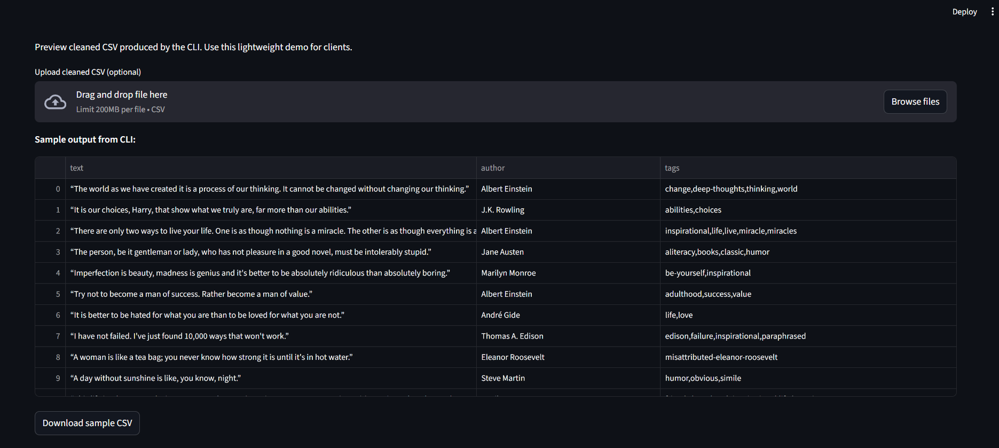

# Web-Extractor-Pro

[](https://web-extractor-pro-bibhu342.streamlit.app)

> 💻 Live Demo: Upload any CSV and preview the cleaned dataset instantly.

> Production-ready web data extractor — Scrape → Clean → Export

A production-grade web data extraction mini-product: **Scrape → Clean → Export**.
Built for freelance delivery with a CLI and an optional Streamlit demo.

---

## 🚀 Features

* Read a list of URLs and scrape structured content.
* Clean and normalize extracted data using **pandas**.
* Export cleaned CSV ready for analytics or client delivery.
* Simple CLI interface for quick runs.
* Optional Streamlit demo for non-technical clients.

---

## ⚙️ Quick Start

1️⃣ **Install dependencies**

```bash
pip install -r requirements.txt
```

2️⃣ **Add target URLs**

```
data/raw_urls.txt
```

3️⃣ **Run the extractor**

```bash
python scripts/web_extractor.py --urls data/raw_urls.txt --output data/cleaned/quotes.csv
```

4️⃣ **Inspect the output**

```
data/cleaned/quotes.csv
```

---

## 🧠 Tech Stack

* **Language:** Python 3.11+
* **Libraries:** requests, beautifulsoup4, pandas, lxml
* **Optional:** streamlit (for demo)

---

## 🎥 Demo Preview



This demo shows how **Web-Extractor-Pro** reads URLs, scrapes structured content
(Quotes, Authors, Tags), cleans it, and exports the data into a ready-to-use CSV —
all viewable in a lightweight **Streamlit dashboard**.

---

## 📁 Folder Structure

```
Web-Extractor-Pro/
├── data/
│   ├── raw_urls.txt
│   ├── scraped/
│   └── cleaned/
├── scripts/
│   └── web_extractor.py
├── streamlit_app/
│   └── app.py
├── assets/
│   └── demo_web_1.png
├── README.md
├── requirements.txt
├── LICENSE
└── .gitignore
```

---

## 👨‍💻 Author

**Bibhudendu Behera**

Python Developer | Data Cleaning | Web Extraction | Automation

📍 Bangalore, India

🔗 [LinkedIn](https://www.linkedin.com/in/bibhudendu-behera-b5375b5b)

